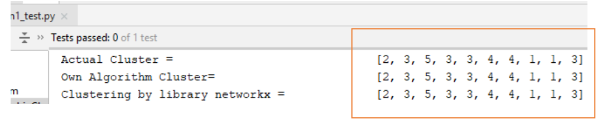

# A0--Zombie-clustering-python-
### Description of problem and Rules:
There are zombies in Seattle. Liv and Ravi are trying to track them down to find out who is creating new zombies in an effort to prevent an apocalypse. 
Other than the patient-zero zombies, new people only become zombies after being scratched by an existing zombie. Zombiism is transitive. This means that if zombie 0 knows zombie 1 and zombie 1 knows zombie 2, then zombie 0 is connected to zombie 2 by way of knowing zombie 1. A zombie cluster is a group of zombies who are directly or indirectly linked through the other zombies they know, such as the one who scratched them or supplies who them with brains.

## Objective: 
  * To find the clusters where nodes(zombies) are connected. 
  * To isolate the cluster which is not connected to Zombie cluster
  
### Example of test case

example 1, Answer expected : result = 2
          [[1, 0, 0, 0, 0],
           [0, 1, 0, 1, 0],
           [0, 0, 1, 1, 1],
           [0, 1, 1, 1, 0],
           [0, 0, 1, 0, 1]]

example 2, Answer expected : result = 3
            [[1, 0, 0, 0, 0],
             [0, 1, 1, 0, 0],
             [0, 1, 1, 0, 0],
             [0, 0, 0, 1, 1],
             [0, 0, 0, 1, 1]]

## Solution: 
  * The python File depicts solution for this problem using Two Methods
     1. Using programming logic without using DFS or BFS
     2. Using Networkx library to cluster the zombie
 
## screenshots of Results

* using solution 1.

* using solution 2, visual representation of cluster of zombies and non zombies

